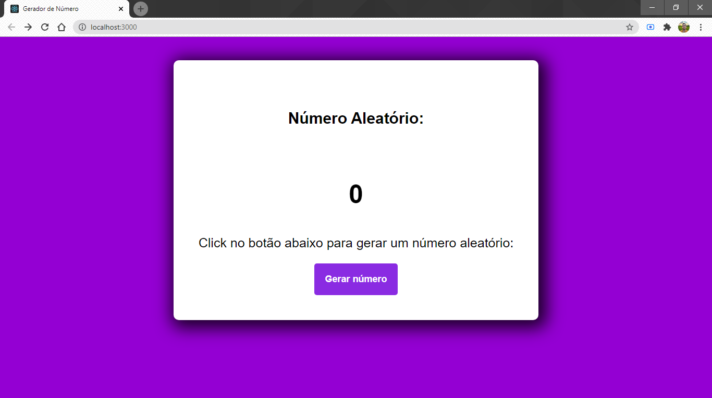

# Projeto React - Gerador de Número Aleatório

    Um projeto que mostra para o usuário um número aleátorio. Após clicar no botão o computador mostra um número aleatório.

### Ilustração da aplicação

  <h1 align="center">
   
  </h1>
  
 ### Tutorial

 <ul>
    <li>Clone este repositório</li>
    <li>Abra o código no VSCode</li>
    <li>Rode a aplicação</li>
 </ul>
